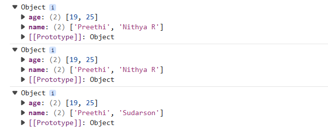

**Day Wrap - 17/06/2026**

Today, I started by solving the LeetCode problem **Process String with Special Operations**. Initially, I used an ArrayList, but due to issues with character handling, I switched to StringBuilder. The logic worked and passed all test cases, but it exceeded memory limits, so I began exploring a backtracking approach, which is not yet fully solved.

I also learned about JSON and why objects are converted into strings. While learning this, I came across the concept of a snapshot and explored how it can be created using `structuredClone(object)`.

Later, our team explored project collaboration in GitHub. One member created a repository and sent an invitation, but it was not visible on our profiles. We then created an organization, set up a repository within it, created a backend folder, and practiced push and pull operations.

The Solution for the leetcode problem:

**Question**
Input: s = "a#b%_", k = 1 Output: "a"
Explanation:
s[i] Operation Current result 0
'a' Append 'a' "a" 1
'#' Duplicate result "aa" 2
'b' Append 'b' "aab" 3
'%' Reverse result "baa" 4
'_' Remove the last character "ba"
The final result is "ba". The character at index k = 1 is 'a'.

import java.util._;
class Stringverify {
public static void main(String[] args) {
Scanner sc = new Scanner(System.in);
System.out.println("Enter the string:");
ArrayList<String> result = new ArrayList<String>();
String s = sc.nextLine();
System.out.println("Enter the value of k:");
long k = sc.nextLong();
for (int i = 0; i < s.length(); i++) {
char currentChar = s.charAt(i);
if (currentChar >= 'a' && currentChar <= 'z') {
result.add(String.valueOf(currentChar));
} else if (currentChar == '%') {
Collections.reverse(result);
} else if (currentChar == '_') {
if (!result.isEmpty()) {
result.remove(result.size() - 1);
}
} else if (currentChar == '#') {
String c = result.toString();
result.add(c);
}
if (k >= 0 && k < result.size()) {
System.out.println(result.get((int) k));
} else {
System.out.println("Index " + k + " out of bounds for current list size " + result.size());
}
}
sc.close();
}
}

**Snapshot**

**Output**
