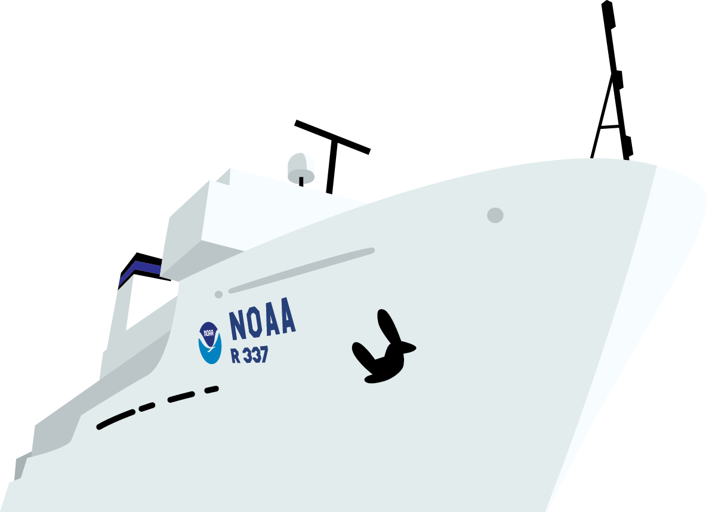
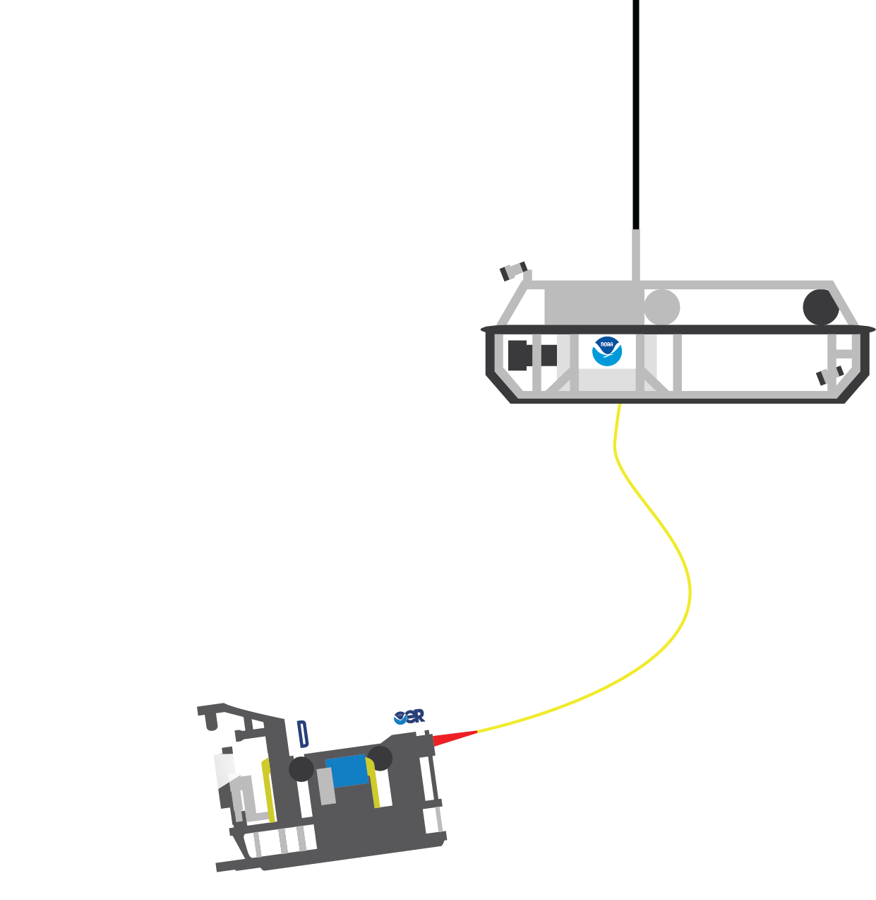
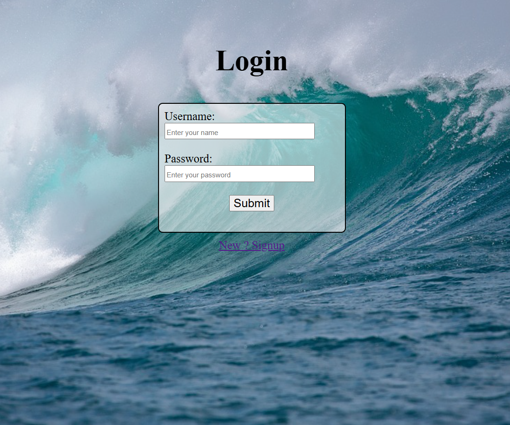
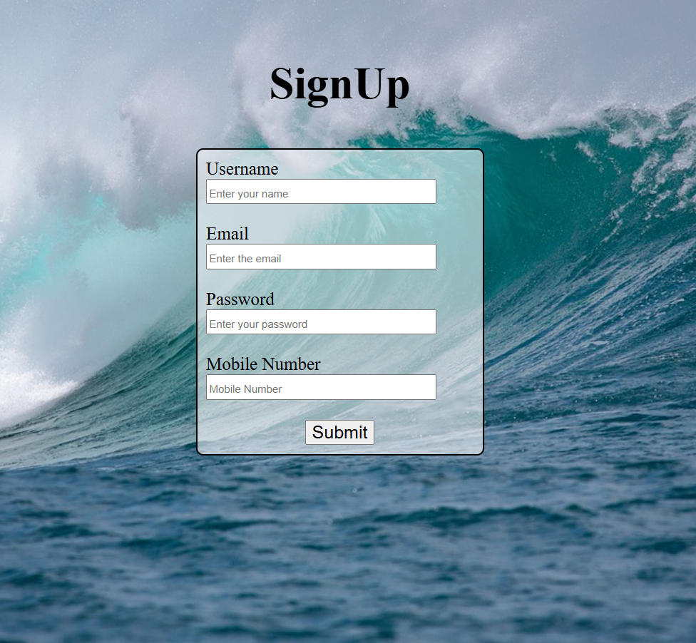
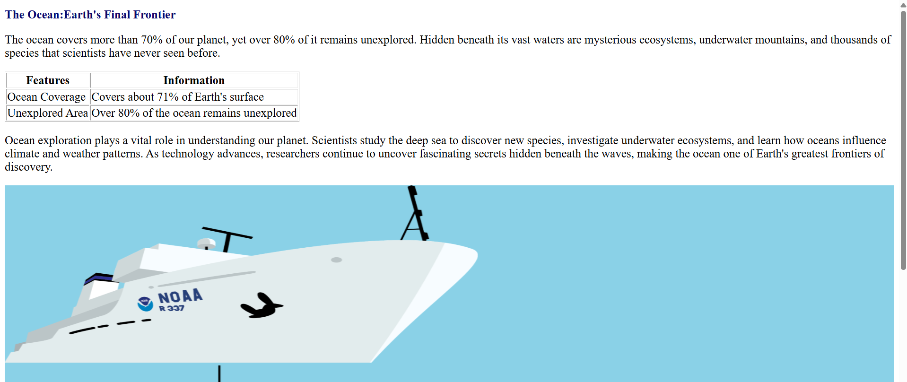
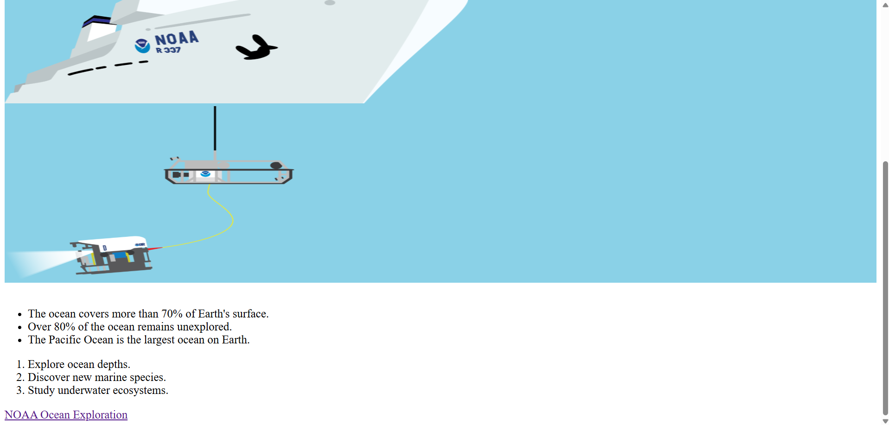

**18/06/2026**
Day Wrap

Today I completed three days of learning.

**Day 1: Orientation – Project Goals & Roles**

Orientation is also known as a Project Kickoff Meeting.
In this stage, no one writes code, builds a project, or performs tasks. The team first focuses on planning.

They define what we need to do, which becomes the project goal.

Many companies use a structured format called RACI:

R → Responsible (people who do the work)
A → Accountable (person who verifies and signs off, usually the manager)
C → Consulted (people who give suggestions or advice before starting)
I → Informed (people who do not perform work but are updated about the project status)
Example

Project goal: Developing a Website

R → Developers
A → Manager (who verifies and signs off)
C → Gives suggestions or advice before starting
I → People who are not directly involved in the work but are informed about the project status

Before starting, they ask: Why? What? How? Who?

For project goals, they mostly use the SMART method, which means:

S → Specific
M → Measurable
A → Achievable
R → Relevant
T → Time-bound
Three Roles in a Project
Project Manager
Project Team Members
Stakeholders
Tools Setup

VS Code, Node.js, and Git setup were already completed.

**Terminal Basics**
dir - Lists files and folders
cd - Changes directory
cd..- Moves one folder back
cls - Clears screen
exit- Closes terminal
mkdir- Creates a new folder
rmdir- Deletes a folder
del - Deletes a file
copy - Copies files
move - Moves files
ren - Renames a file
type - Displays file content
ipconfig - Shows IP configuration
ping - Tests network connection
tracert - Traces network path
netstat - Shows network connections
tasklist- Lists running processes
taskkill- Stops a process
systeminfo - Shows system details
whoami - Shows current user
set - Displays environment variables
echo - Prints text in terminal
start - Opens application or file
shutdown - Shuts down or restarts PC
tree - Shows folder structure

**Git Basics**
git --version – Displays the installed Git version.
git config --global user.name "Preethi" – Sets your Git username globally.
git config --global user.email "email@example.com" – Sets your Git email globally.
git config --global init.defaultBranch main – Sets main as the default branch for all new Git repositories.
git config user.name – Displays the configured Git username.
git config user.email – Displays the configured Git email.
git init – Initializes a new Git repository in the current directory.
git status – Shows the status of tracked, modified, and untracked files.
git add . – Stages all new and modified files for the next commit.
git add <file> – Stages a specific file for the next commit.
git commit -m "message" – Saves the staged changes with a commit message.
git remote add origin <repository-url> – Adds a remote repository named origin.
git remote -v – Displays the remote repository URLs for fetch and push.
git remote set-url origin <repository-url> – Changes the URL of the existing remote repository.
git branch – Lists all local branches.
git branch -M main – Renames the current branch to main.
git push -u origin main – Pushes the local main branch to the remote repository and sets it as the upstream branch.
pwd – Displays the current working directory.
ls – Lists the files and folders in the current directory.
ls -l – Lists files with detailed information.
ls -a – Lists all files, including hidden files.
cd <directory> – Changes the current working directory.
mkdir <folder> – Creates a new directory.
rmdir <folder> – Removes an empty directory.
touch <filename> – Creates a new empty file.
cat <filename> – Displays the contents of a file.
echo "text" > filename – Writes text to a file, replacing its existing content.
echo "text" >> filename – Appends text to the end of a file.
cp source destination – Copies a file from one location to another.
mv oldname newname – Moves or renames a file or directory.
rm <filename> – Deletes a file.
rm -r <directory> – Deletes a directory and its contents recursively.
rm -rf .git – Forcefully removes the .git directory and all Git history.
history – Displays the history of previously executed commands.

**HTML basics: tags & page structure**

<!DOCTYPE html>
<html lang="en">
<head>
    <meta charset="UTF-8">
    <title>GetSetGo</title>
</head>
<body>
    <h1>Welcoming all</h1>
    
Let's get ready

</body>
</html>

**Day 2 :HTML**

**Headings, text, lists,Links, images, forms,Semantic HTML; build a page**

**Tags**

<!DOCTYPE html> – Declares that the document is an HTML5 document.
<html> – Represents the root element of an HTML document.
<head> – Contains metadata and information about the webpage.
<title> – Sets the title displayed on the browser tab.
<body> – Contains all the visible content of the webpage.
<form> – Creates a form to collect user input.

 – Groups related HTML elements into a section.
<label> – Defines a label for an input field.
<input> – Creates an input field for user data.
  – Inserts a single line break.
<a> – Creates a hyperlink to another page or website.
<h1> – Defines the main heading of the webpage.

 – Defines a paragraph of text.
<table> – Creates a table to organize data into rows and columns.
<thead> – Groups the header content of a table.
<tbody> – Groups the main content of a table.
<tr> – Defines a row in a table.
<th> – Defines a header cell in a table.
<td> – Defines a data cell in a table.
 – Displays an image on the webpage.
<ul> – Creates an unordered (bulleted) list.
<li> – Defines an item in a list.
<ol> – Creates an ordered (numbered) list.

**Attributes**

action – Specifies where the form data should be sent after submission.
method – Specifies the HTTP method (GET or POST) used to submit the form.
for – Associates a <label> with a specific input element.
type – Specifies the type of input field (e.g., text, password, button).
id – Assigns a unique identifier to an HTML element.
placeholder – Displays hint text inside an input field.
required – Makes an input field mandatory before form submission.
value – Specifies the value displayed on an input button.
href – Specifies the destination URL of a hyperlink.
target="\_blank" – Opens the linked page in a new browser tab.
src – Specifies the path of an image file.
alt – Provides alternative text for an image.
height – Sets the height of an element, such as an image.
width – Sets the width of an element, such as an image.
border – Specifies the border thickness of a table

Implemented these tags and attributes in the below program

**index.html**

<!DOCTYPE html>
<html lang="en">
    <head>
        <title>Interesting Facts</title>
    </head>
    <body>
       <form action="firstpage.html" method="get">
        

            <label for="username">Username:</label>
            <input type="text" id="username" placeholder ="Enter your name" required>
        

         
        

            <label for="password">Password:</label>
            <input type="password" id="password" placeholder="Enter your password" required>
        

         
        

            <a href="firstpage.html">
                <input type="button" value="Submit" >
            </a>
        

       </form>
    </body>
</html>

**firstpage.html**

<!doctype html>
<html>
  <head>
    <title>Intrestingfact</title>
  </head>
  <body>
    <h1 id="heading">The Ocean:Earth's Final Frontier</h1>
    

      The ocean covers more than 70% of our planet, yet over 80% of it remains
      unexplored. Hidden beneath its vast waters are mysterious ecosystems,
      underwater mountains, and thousands of species that scientists have never
      seen before.
    

    <table border="1">
      <thead>
        <tr>
          <th>Features</th>
          <th>Information</th>
        </tr>
      </thead>
      <tbody>
        <tr>
          <td>Ocean Coverage</td>
          <td>Covers about 71% of Earth's surface</td>
        </tr>
        <tr>
          <td>Unexplored Area</td>
          <td>Over 80% of the ocean remains unexplored</td>
        </tr>
      </tbody>
    </table>
    

      Ocean exploration plays a vital role in understanding our planet.
      Scientists study the deep sea to discover new species, investigate
      underwater ecosystems, and learn how oceans influence climate and weather
      patterns. As technology advances, researchers continue to uncover
      fascinating secrets hidden beneath the waves, making the ocean one of
      Earth's greatest frontiers of discovery.
    

    
     
    
     
    <ul>
      <li>The ocean covers more than 70% of Earth's surface.</li>
      <li>Over 80% of the ocean remains unexplored.</li>
      <li>The Pacific Ocean is the largest ocean on Earth.</li>
    </ul>
    <ol>
      <li>Explore ocean depths.</li>
      <li>Discover new marine species.</li>
      <li>Study underwater ecosystems.</li>
    </ol>
    <a
      href="https://oceanexplorer.noaa.gov/facts/exploration.html?utm_source=chatgpt.com"
      target="_blank"
      >NOAA Ocean Exploration</a
    >
  </body>
</html>

**Day 3 : CSS basics**

**index.html**

<!doctype html>
<html lang="en">
  <head>
    <title>Interesting Facts</title>
    <link rel="stylesheet" href="styles.css" />
  </head>
  <body class="b">
    <h1 id="h">Login</h1>
    

      <form action="firstpage.html" method="get">
        

          

            <label for="username">Username:</label>
            <input
              type="text"
              id="username"
              placeholder="Enter your name"
              required
            />
          

           
          

            <label for="password">Password:</label>
            <input
              type="password"
              id="password"
              placeholder="Enter your password"
              required
            />
          

           
          

            <input type="submit" value="Submit" />
          

          

          

          
        

        <nav id="r">
                <a href ="register.html"> New ? Signup</a>
            </nav>
      </form>
    

  </body>
</html>

**register.html**

<!doctype html>
<html lang="en">
  <head>
    <title>Interesting Facts</title>
    <link rel="stylesheet" href="styles.css" />
  </head>
  <body class="b">
    <h1 id="h">SignUp</h1>
    

      <form action="index.html" method="get">
        

          

            <label for="username">Username</label>
            <input
              type="text"
              id="username"
              placeholder="Enter your name"
              required
            />
          

           
          

            <label for="email">Email</label>
            <input
              type="email"
              id="email"
              placeholder="Enter the email"
              required
            />
          

           

          

            <label for="password">Password</label>
            <input
              type="password"
              id="password"
              placeholder="Enter your password"
              required
            />
          

           
          

            <label for="mobileno">Mobile Number</label>
            <input
              type="number"
              id="mobileno"
              placeholder="Mobile Number"
              required
            />
          

           

          

            <input type="submit" value="Submit" />
          

          

        

      </form>
    

  </body>
</html>

**firstpage.html**

<!doctype html>
<html>
  <head>
    <title>Intrestingfact</title>
    <link rel="stylesheet" href="styles.css" />
  </head>
  <body>
    <h1 id="heading">The Ocean:Earth's Final Frontier</h1>
    

      The ocean covers more than 70% of our planet, yet over 80% of it remains
      unexplored. Hidden beneath its vast waters are mysterious ecosystems,
      underwater mountains, and thousands of species that scientists have never
      seen before.
    

    <table border="1">
      <thead>
        <tr>
          <th>Features</th>
          <th>Information</th>
        </tr>
      </thead>
      <tbody>
        <tr>
          <td>Ocean Coverage</td>
          <td>Covers about 71% of Earth's surface</td>
        </tr>
        <tr>
          <td>Unexplored Area</td>
          <td>Over 80% of the ocean remains unexplored</td>
        </tr>
      </tbody>
    </table>
    

      Ocean exploration plays a vital role in understanding our planet.
      Scientists study the deep sea to discover new species, investigate
      underwater ecosystems, and learn how oceans influence climate and weather
      patterns. As technology advances, researchers continue to uncover
      fascinating secrets hidden beneath the waves, making the ocean one of
      Earth's greatest frontiers of discovery.
    

    

      

       
      
    

     
    <ul>
      <li>The ocean covers more than 70% of Earth's surface.</li>
      <li>Over 80% of the ocean remains unexplored.</li>
      <li>The Pacific Ocean is the largest ocean on Earth.</li>
    </ul>
    <ol>
      <li>Explore ocean depths.</li>
      <li>Discover new marine species.</li>
      <li>Study underwater ecosystems.</li>
    </ol>
    <a
      href="https://archive.oceanexplorer.noaa.gov/welcome.html"
      target="_blank"
      >NOAA Ocean Exploration</a
    >

  </body>
</html>

**CSS Styles**

#heading {
color: rgb(8, 8, 110);
}
.box {
border: 2px solid black;
padding: 10px;
margin: 10px;
width: 300px;
height: 200px;
background-color: rgb(246, 247, 248, 0.6);
border-radius: 8px;
}
.s {
text-align: center;
}
.image-box {
background-color: rgb(138, 209, 231);
}

- {
  font-size: 20px;
  }
  #h {
  font-size: 50px;
  text-align: center;
  }
  .b {
  background-image: url("images/backgroundimage.jpg");
  background-size: cover;
  background-repeat: no-repeat;
  background-position: center;
  height: 100vh;
  margin-top: 75px;
  }
  .container {
  display: flex;
  justify-content: center;
  }
  #r {
  text-align: center;
  color: white;
  }
  .bb {
  border: 2px solid black;
  padding: 10px;
  margin: 10px;
  width: 300px;
  height: 380 px;
  background-color: rgb(246, 247, 248, 0.6);
  border-radius: 8px;
  }
  .c {
  display: flex;
  justify-content: center;
  margin-top: 75 px;
  }
  .ss {
  text-align: center;
  }
  input::placeholder {
  font-size: 12px;
  border-radius: 20 px;
  }

Output:

