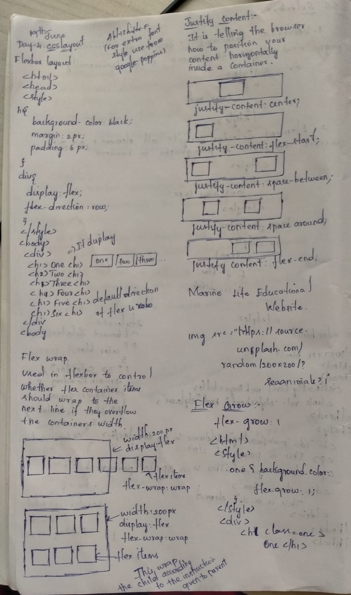
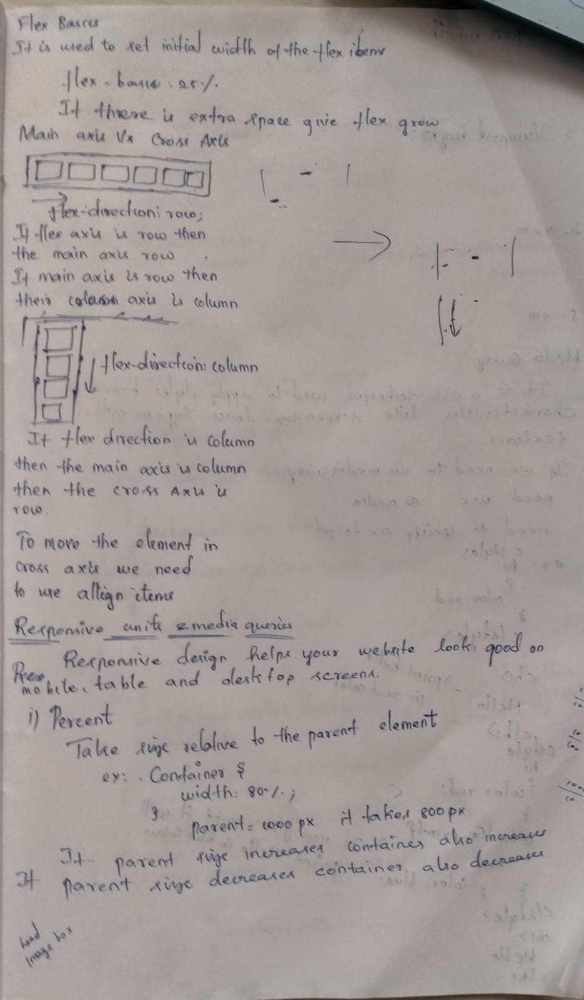

**19/06/2026**
**Day 4 - CSS Layout**

Flexbox is a one-dimensional layout system used to arrange items in rows or columns efficiently.

```css
.container {
  display: flex;
}
```

### Flex Direction

Controls the direction of flex items.

```css
.container {
  display: flex;
  flex-direction: row;
}
```

Values:

- row (default)
- column
- row-reverse
- column-reverse

### Justify Content

Aligns items along the main axis.

```css
.container {
  display: flex;
  justify-content: center;
}
```

Common values:

- flex-start
- flex-end
- center
- space-between
- space-around
- space-evenly

### Flex Wrap

Allows items to move to the next line when there is not enough space.

```css
.container {
  display: flex;
  flex-wrap: wrap;
}
```

Values:

- nowrap (default)
- wrap
- wrap-reverse

### Flex Grow

Specifies how much a flex item should grow relative to other items.

```css
.item {
  flex-grow: 1;
}
```

# Responsive Units

Responsive units are relative measurements that automatically adapt to screen size, parent elements, or browser dimensions. They help create responsive web designs that work well on mobile, tablet, and desktop devices.

### Percentage (%)

Relative to the parent container.

```css
.container {
  width: 80%;
}
```

### Viewport Width (vw)

Relative to 1% of the viewport width.

```css
h1 {
  font-size: 5vw;
}
```

### Viewport Height (vh)

Relative to 1% of the viewport height.

```css
.banner {
  height: 100vh;
}
```

### rem

Relative to the root (`html`) font size.

```css
html {
  font-size: 16px;
}
h1 {
  font-size: 2rem;
}
```

### em

Relative to the font size of the immediate parent element.

```css
.parent {
  font-size: 20px;
}
.child {
  font-size: 1.5em;
}
```

---

# Media Queries

Media Queries allow us to apply CSS styles based on device characteristics such as screen width, height, or orientation.

### Example

```css
@media (max-width: 768px) {
  nav {
    flex-direction: column;
    gap: 10px;
  }
}
```

In the above example:

- When the screen width is 768px or less,
- The navigation items are displayed vertically.
- A gap of 10px is applied between items.
  
  

---

**Day - 5 Git Branch Commands**

## View Branches

```bash
git branch
```

## Create a New Branch

```bash
git switch -c branch-name
```

or

```bash
git checkout -b branch-name
```

## Switch Branches

```bash
git switch branch-name
```

## Push a Branch

```bash
git push -u origin branch-name
```

## Merge a Branch into Main

```bash
git switch main

git merge branch-name

git push origin main
```

## Delete a Local Branch

```bash
git branch -d branch-name
```

---

# Typical Git Workflow

```bash
git switch -c feature-branch

git add .

git commit -m "Added new feature"

git push -u origin feature-branch

git switch main

git merge feature-branch

git push origin main
```
